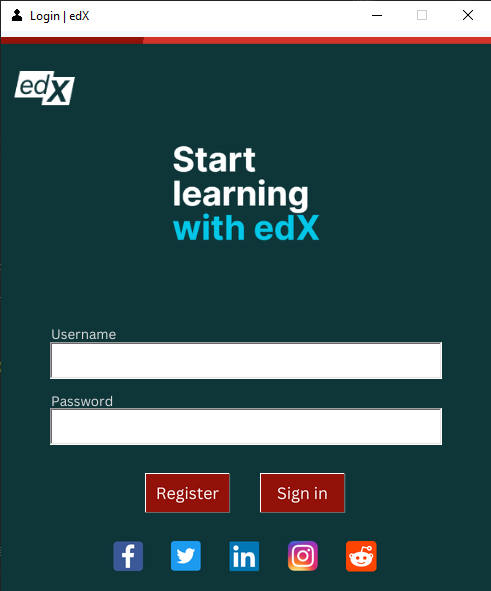
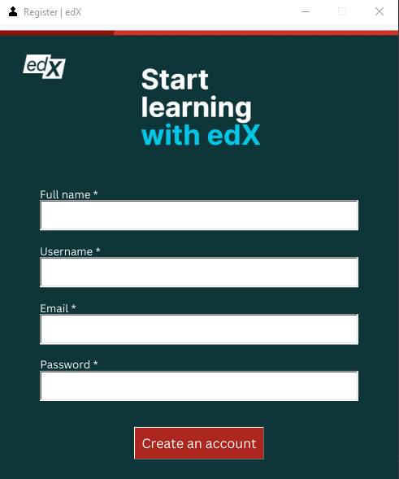
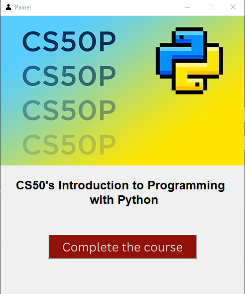

# **edX Authenticator**


## **Introduction**
***
My project is a user authenticator. The user will be able log into the account he created and complete the CS50's Introduction to Programming with Python.


## **Technologies**
***
* [Python](https://www.python.org/): Version 3.10.8
* [Tkinter](https://tkdocs.com/): Version 8.6.12
* [Pytest](https://pytest.org/): Version 7.1.3


## **General Info**
***
The program is a login and register form. The user can create an account and then log into the created account. When logging into the account, the user will see a "CS50's Introduction to Programming with Python" course completion button. Then a congratulations message for completing the course.

This project is a simple example of how to create an authenticator. I think it might help some beginners like me to get an idea of how to create a login and register form for many other projects.

The focus was to show the authenticator. Everything that was done after the user logged into the account was just to show the completion of the course.

To save the user data, I used the [CSV module](https://docs.python.org/3/library/csv.html), writing the information with DictWriter and to read the csv file, DictReader. Every time an account is created, a csv file will be generated in the "users" folder. I'll learn how to create a database to store the data and I'll use in my next projects.


## **Screenshots**
***
* #### Login


* #### Register


* #### User Painel



## **Video project demonstration**
***

### Click on [My project video demonstration on youtube](https://youtu.be/NYI09DLSaJo) to watch.
 

## **Launch**
***
Make sure you are in the project folder.
```
$ cd project
project/ $ python .\project.py
```
 
 
## **Installation**
***
### **Python**
Please see the [Python downloads](https://www.python.org/downloads/) page for the most up to date versions of Python. They are available via the yellow download buttons on that page.

Check your installed version:
```
python --version
```
 
### **Tkinter**
You need to check the tkinter is installed. To verify whether Tkinter is installed ready to be loaded by Python, run the following code in a Python console:
```
import tkinter
tkinter._test()
```
You can also get the exact version of Tcl/Tk that is being used with:
```
tkinter.Tcl().eval('info patchlevel')
```

### **Pytest**
Run the following command in your command line:
```
pip install -U pytest
```
Check your installed version:
```
pytest --version
```
 
 
## **FAQs**
***
### 1. **Why did you use edX as an example to create the program?**
### _I was thinking of simulating my course completion through a program._. 

### 2. **How many times have you done a final project?** 
### _This was the first time doing a project, I know there are a lot of mistakes, but in the future, I will create a lot of projects to improve my knowledge._
 ---

## **About edX**
***
### **Transformation through education**

Every individual has the potential to create change, whether in their life, their community, or the world. The transformative power of education is what unlocks that potential. Yet, access to high-quality education has been a privilege of the few. Back in 2012, we realized it was a time for a seismic shift in learning. From the tried and true to the leading edge. From “for some” to “for all.” By opening the classroom through online learning, edX empowers millions of learners to unlock their potential and become changemakers.

### **Start the Python course now clicking on [CS50's Introduction to Programming with Python](https://www.edx.org/course/cs50s-introduction-to-programming-with-python)**
### **To see all available courses, click on [All available courses](https://www.edx.org/search?tab=course)**
